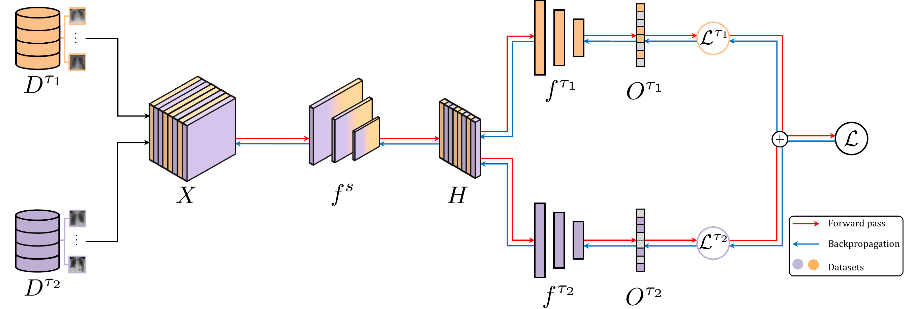

<div align="center">


# Multi-Dataset Multi-Task Learning for COVID-19 Prognosis

<p align="center">
  
</p>

[](https://link.springer.com/chapter/10.1007/978-3-031-72390-2_24)
[](https://link.springer.com/chapter/10.1007/978-3-031-72390-2_24)
[](https://www.python.org/)
[](https://pytorch.org/)
[](https://hydra.cc/)
[](https://creativecommons.org/licenses/by-nc/4.0/)

**A novel Multi-Dataset Multi-Task (MDMT) learning framework that predicts COVID-19 prognostic outcomes from chest X-rays by jointly training on two publicly available datasets with distinct but correlated labelling schemes — AIforCOVID (severity prognosis) and BRIXIA (severity score assessment) — without requiring universal cross-dataset annotations.**

**Filippo Ruffini** · Lorenzo Tronchin · Zhuoru Wu · Wenting Chen · Paolo Soda · Linlin Shen · **Valerio Guarrasi**

*Unit of Computer Systems & Bioinformatics, Università Campus Bio-Medico di Roma · College of Computer Science and Software Engineering, Shenzhen University · Department of Electrical Engineering, City University of Hong Kong*

[📄 Paper](https://link.springer.com/chapter/10.1007/978-3-031-72390-2_24) ·
[🧩 Framework](#framework) ·
[⚙️ Setup](#setup) ·
[🚀 Usage Guide](#using-the-repository) ·
[📊 Results](#results) ·
[📚 Citation](#citation)

</div>

---

## Overview

This repository accompanies the paper *"Multi-Dataset Multi-Task Learning for COVID-19 Prognosis"*, accepted at **MICCAI 2024** (main conference, poster presentation) and published in the MICCAI 2024 Proceedings ([doi: 10.1007/978-3-031-72390-2_24](https://link.springer.com/chapter/10.1007/978-3-031-72390-2_24)).

We introduce a **Multi-Dataset Multi-Task (MDMT) learning framework** that leverages two publicly available COVID-19 CXR datasets — each annotated with a different but complementary prognostic signal — within a single unified training pipeline. Our central hypothesis is that jointly learning to assess radiological severity (BRIXIA, task τ₂) enhances the model's ability to classify prognostic outcome groups (AIforCOVID, task τ₁), improving both performance and robustness.

**Key contributions:**

1. A MDMT model for two publicly available COVID-19 CXR datasets, each assigned to a distinct task, trained end-to-end with a shared CNN backbone and task-specific fully connected heads.
2. A multi-task loss function incorporating an indicator function that enables gradient-level disentanglement across heterogeneous data sources.
3. Extensive evaluation across **18 CNN architectures** and **2 validation strategies** (5-fold CV and Leave-One-Center-Out), with rigorous statistical analysis, demonstrating significant improvements over STL and fine-tuning baselines.

---

## Framework

<p align="center">
  
</p>

> **Figure 1 — MDMT model architecture.**
> A single batch *X* is formed by randomly sampling from both datasets D^τ₁ (AIforCOVID) and D^τ₂ (BRIXIA). A shared CNN backbone *f^s* extracts a common feature representation *H*, which is routed to two task-specific fully connected heads *f^τ₁* and *f^τ₂*. The indicator function *I(Xᵢ, τⱼ)* masks out loss contributions from samples not belonging to each task, enabling end-to-end joint optimisation without cross-dataset label requirements.

### Multi-Task Loss

$$\mathcal{L} = \sum_{i=1}^{|X|} \mathcal{I}(X_i, \tau_1) \cdot \mathcal{L}^{\tau_1}(O^{\tau_1}_i, Y^{\tau_1}_i) + \mathcal{I}(X_i, \tau_2) \cdot \mathcal{L}^{\tau_2}(O^{\tau_2}_i, Y^{\tau_2}_i)$$

### Experimental Configurations

| Configuration | Symbol | Description |
|---|---|---|
| Single-Task Learning (AIforCOVID) | STL^τ₁ | CNN backbone trained on τ₁ alone |
| Single-Task Learning (BRIXIA) | STL^τ₂ | CNN backbone trained on τ₂ alone |
| Fine-Tuning | FT | STL^τ₂ model fine-tuned on τ₁ |
| **Multi-Dataset Multi-Task** | **MDMT** | **Proposed: joint training on both tasks** |

---

## Datasets

| Dataset | Task | Symbol | Samples | Centers | Labels | Validation |
|---|---|---|---|---|---|---|
| **AIforCOVID** ([Soda et al., 2021](https://doi.org/10.1016/j.media.2021.102216)) | Severity prognosis (Mild vs. Severe) | τ₁ | 1 586 | 6 | Binary | LOCO |
| **BRIXIA** ([Signoroni et al., 2021](https://doi.org/10.1016/j.media.2021.101945)) | Severity score assessment | τ₂ | 4 707 | Multiple | 4-class | — |

**AIforCOVID (D^τ₁):** 1 586 CXR from COVID-19-positive adults across 6 Italian centres. Patients are classified as *mild* (home isolation / hospitalisation without ventilatory support) or *severe* (NIV, ICU, or death). Collected in three successive releases.

**BRIXIA (D^τ₂):** 4 707 CXR from sub-intensive and intensive care. The Brixia score grades lung opacity in 6 regions (0–3 each). Regional scores are summed and binned into four categories (0–3).

**Preprocessing pipeline (both datasets):** lung segmentation via U-Net → bounding-box extraction → resize to 256×256 → ImageNet normalisation.

---

## Backbone Architectures

18 CNN backbones across 6 architectural families, all pre-trained on ImageNet:

| Family | Models |
|---|---|
| DenseNet | DenseNet-121, DenseNet-161, DenseNet-169, DenseNet-201 |
| EfficientNet | EfficientNet-b0, EfficientNet-b1-p, EfficientNet-es, EfficientNet-es-p, EfficientNet-lite |
| GoogLeNet | GoogLeNet |
| MobileNet | MobileNet |
| ResNet | ResNet-18, ResNet-34, ResNet-50, ResNet-101, Wide-ResNet50-2 |
| ShuffleNet | ShuffleNet-v2-x0, ShuffleNet-v2-x1 |

---

## Repository Layout

```
.
├── configs/
│   ├── common/
│   │   ├── common_multi.yaml           # Shared hyperparameters for MDMT
│   │   ├── common_morbidity.yaml       # Shared hyperparameters for STL^τ₁
│   │   └── common_severity.yaml        # Shared hyperparameters for STL^τ₂
│   ├── bash_experiments/               # JSON files that enumerate backbone sweeps
│   ├── 5/                              # Experiment-specific configs for 5-fold CV
│   │   ├── morbidity/
│   │   ├── severity/
│   │   └── multi/
│   ├── loCo/                           # Experiment-specific configs for LOCO
│   │   ├── morbidity/
│   │   ├── severity/
│   │   └── multi/
│   └── *_debug.yaml                    # Quick-iteration debug configs
│
├── scripts/                            # Single-GPU terminal launchers (run from repo root)
│   ├── preprocess_aiforcovid.sh        # AIforCOVID: DICOM → TIFF → masks + bboxes
│   ├── preprocess_brixia.sh            # BRIXIA: DICOM → TIFF → masks + bboxes
│   ├── train_stl_aiforcovid.sh         # Train STL^τ₁
│   ├── train_stl_brixia.sh             # Train STL^τ₂
│   ├── train_mdmt.sh                   # Train MDMT (proposed method)
│   ├── run_experiments.py              # Batch launcher — runs many backbones locally
│   └── aggregate_results.sh            # Aggregate fold results + statistical analysis
│
├── src/
│   ├── models/
│   │   ├── train_MultiObjectiveModel.py    # MDMT training entry point
│   │   ├── train_morbidity_SingleTask.py   # STL^τ₁ training entry point
│   │   ├── train_severity_SingleTask.py    # STL^τ₂ training entry point
│   │   └── predict_morbidity.py            # Inference script
│   ├── preprocessing/
│   │   ├── AFC/
│   │   │   ├── ClinicalDataCreation_AFC.py # Step 1: DICOM → TIFF for AIforCOVID
│   │   │   └── segmentation_AFC.py         # Step 2: U-Net lung masks + bboxes
│   │   └── BRIXIA/
│   │       ├── convertDicom_brixia.py      # Step 1: DICOM → TIFF for BRIXIA
│   │       └── segmentation_BX.py          # Step 2: U-Net lung masks + bboxes
│   ├── datasets/
│   │   └── organization/               # Dataset iterators and augmentation pipeline
│   ├── postprocessing/
│   │   ├── Create_Final_Report.py      # Aggregate per-fold results into tables
│   │   ├── plot_results.py             # Visualisation of aggregated results
│   │   ├── results_interface.py        # Interactive Dash results explorer
│   │   └── statistical_analysis/
│   │       └── compute_statistical_scores.py  # One-tail t-test comparisons
│   └── utils/                          # Data loading, model builders, training loops
│
├── figures/
│   ├── method.pdf / method.png         # Model architecture figure
│   └── miccai_2024_logo.png
├── requirements/
│   └── requirements.txt
├── Paper-4049.tex                      # Camera-ready LaTeX source
└── supplementary.tex                   # Full per-backbone results table
```

---

## Setup

### 1. Clone the repository

```bash
git clone https://github.com/fruffini/Multi-Dataset-Multi-Task-Learning-for-COVID-19-Prognosis.git
cd Multi-Dataset-Multi-Task-Learning-for-COVID-19-Prognosis
```

### 2. Create the Python environment

```bash
python3.9 -m venv covid-env
source covid-env/bin/activate       # Windows: covid-env\Scripts\activate
pip install --upgrade pip
pip install -r requirements/requirements.txt
```

> **GPU note.** The paper used 4 × NVIDIA TESLA A100 GPUs with batch size 128. For a single GPU with less memory, reduce `batch_size` in the relevant config file under `configs/`.

### 3. Download the datasets

Create the following directory layout at the project root:

```
data/
├── AIforCOVID/
│   ├── imgs/           ← release 1 DICOMs
│   ├── imgs_r2/        ← release 2 DICOMs
│   ├── imgs_r3/        ← release 3 DICOMs
│   ├── AIforCOVID.xlsx
│   ├── AIforCOVID_r2.xlsx
│   └── AIforCOVID_r3.xlsx
└── BRIXIA/
    ├── dicom_clean/    ← cleaned DICOM files
    └── metadata_global_v2.csv
```

**AIforCOVID** — register and download from the [AIforCOVID portal](https://aiforcovid.radiomica.it/) or the [Zenodo record](https://doi.org/10.5281/zenodo.5760978).

**BRIXIA** — download from the [BRIXIA dataset page](https://brixia.github.io/) (public release).

### 4. Download the U-Net segmentation weights

The preprocessing pipeline uses a pre-trained U-Net (BSNet) to segment the lungs. Place the weights as follows:

```
models/
└── segmentation_brixia/
    ├── trained_model.hdf5                   ← used for AIforCOVID
    └── segmentation_brixia-model.h5         ← used for BRIXIA
```

Weights are available from the [BSNet repository](https://github.com/BrixIA/Brixia-score-COVID-19).

### 5. Download cross-validation split files

The fold definitions (CV splits and LOCO assignments) are stored under `data/processed/`. These are committed to the repository and require no additional steps.

---

## Using the Repository

### Step 1 — Preprocess the datasets

Run both preprocessing pipelines once before any training.

```bash
# AIforCOVID: converts DICOMs → TIFFs → lung masks → bounding-box manifest
bash scripts/preprocess_aiforcovid.sh

# BRIXIA: converts DICOMs → TIFFs → lung masks → bounding-box manifest
bash scripts/preprocess_brixia.sh
```

Each script accepts optional path overrides — run with `--help` for details.

After preprocessing, the directory layout will be:

```
data/
├── AIforCOVID/
│   └── processed/
│       ├── images/              ← converted TIFFs
│       ├── masks/               ← binary lung masks
│       └── box_data_AXF123.xlsx ← bounding-box manifest consumed by the DataLoader
└── BRIXIA/
    ├── images/                  ← converted TIFFs
    └── processed/
        ├── masks/               ← binary lung masks
        └── box_data_BX.xlsx     ← bounding-box manifest
```

### Step 2 — Train a single model

All scripts are run from the **repository root**.

**STL^τ₁ — Single-Task on AIforCOVID (severity prognosis)**

```bash
# Default: resnet18, 5-fold CV, release 3
bash scripts/train_stl_aiforcovid.sh

# Custom backbone and LOCO validation
bash scripts/train_stl_aiforcovid.sh \
    densenet121 \
    configs/loCo/morbidity/afc_config_singletask_loCo.yaml \
    3 my_run

# Resume from checkpoint
bash scripts/train_stl_aiforcovid.sh resnet18 \
    configs/5/morbidity/afc_config_singletask_cv5.yaml 3 1 -c
```

**STL^τ₂ — Single-Task on BRIXIA (severity score)**

```bash
# Default: resnet18, 5-fold CV, global Brixia score
bash scripts/train_stl_brixia.sh

# EfficientNet-b0, per-lung score, LOCO
bash scripts/train_stl_brixia.sh \
    efficientnet_b0 \
    configs/loCo/severity/bx_config_singletask_loCo.yaml \
    brixia_Lung BASELINE_Lung
```

**MDMT — Multi-Dataset Multi-Task (proposed method)**

```bash
# Default: resnet18, 5-fold CV, global score, release 3
bash scripts/train_mdmt.sh

# DenseNet-201, LOCO, release 3
bash scripts/train_mdmt.sh \
    densenet201 \
    configs/loCo/multi/parallel_config_multitask_loCo18.yaml \
    brixia_Global 3 my_run

# Resume from checkpoint
bash scripts/train_mdmt.sh resnet18 \
    configs/5/multi/parallel_config_multitask_cv5.yaml brixia_Global 3 1 -c
```

**Positional arguments for all train scripts:**

| Position | STL^τ₁ | STL^τ₂ | MDMT |
|---|---|---|---|
| 1 | MODEL | MODEL | MODEL |
| 2 | CFG | CFG | CFG |
| 3 | RELEASE (1/2/3) | STRUCTURE | STRUCTURE |
| 4 | ID_EXP | ID_EXP | RELEASE (1/2/3) |
| 5 | `-c` to resume | `-c` to resume | ID_EXP |
| 6 | — | — | `-c` to resume |

**Available STRUCTURE values:** `brixia_Global` · `brixia_Lung` · `regression`

### Step 3 — Run a full backbone sweep

`scripts/run_experiments.py` iterates over all backbone × structure combinations defined in a JSON config and runs them sequentially (or in parallel with `--max_jobs`). Stdout/stderr of each job is written to `logs/<job_tag>.log`.

```bash
# MDMT, 5-fold CV, all 18 backbones — one at a time (single GPU)
python scripts/run_experiments.py -k multi -e 5 -id 1

# STL^τ₁, LOCO
python scripts/run_experiments.py -k morbidity -e L -id 1

# STL^τ₂, 5-fold CV
python scripts/run_experiments.py -k severity -e 5 -id BASELINE

# Run 4 backbones in parallel (multi-GPU or time-multiplexing)
python scripts/run_experiments.py -k multi -e 5 -id 1 --max_jobs 4

# Resume all runs from checkpoint
python scripts/run_experiments.py -k multi -e 5 -id 1 -c
```

| Flag | Description | Default |
|---|---|---|
| `-k` | Modality: `morbidity` / `severity` / `multi` | `morbidity` |
| `-e` | Experiment key (see table below) | `5` |
| `-id` | Experiment identifier (checkpoint prefix) | `1` |
| `-c` | Resume each job from its latest checkpoint | — |
| `--max_jobs` | Max parallel processes | `1` |

**Experiment key reference:**

| `-k` | `-e` | Config loaded |
|---|---|---|
| `multi` | `5` | `experiment_setups_multitask_parallel_5.json` |
| `multi` | `L6` | `experiment_setups_multitask_parallel_loCo_6.json` |
| `morbidity` | `5` | `experiment_setups_morbidity_5.json` |
| `morbidity` | `10` | `experiment_setups_morbidity_10.json` |
| `morbidity` | `L` | `experiment_setups_morbidity_loCo.json` |
| `severity` | `5` | `experiment_setups_severity_5.json` |
| `severity` | `L` | `experiment_setups_severity_loCo.json` |

### Step 4 — Aggregate results and run statistical tests

```bash
bash scripts/aggregate_results.sh          # release 3, results stored in data_root
bash scripts/aggregate_results.sh 2        # release 2
```

Summary tables are written to `reports/`. Statistical comparisons (one-tail *t*-test, MDMT vs STL^τ₁ and MDMT vs FT) are printed to stdout.

### Step 5 — Explore results interactively

```bash
python src/postprocessing/results_interface.py
# Open http://localhost:8050
```

---

## Results

### Average performance across all 18 backbones (task τ₁)

| Experiment | CV ACC | CV F1 | CV GM | LOCO ACC | LOCO F1 | LOCO GM |
|---|:---:|:---:|:---:|:---:|:---:|:---:|
| STL^τ₁ | 66.0 | 63.9 | 65.9 | 61.2 | 57.3 | 60.1 |
| FT | 67.3 | 63.1 | 66.9 | 64.8 | 58.9 | 63.8 |
| **MDMT** | **68.6** | **66.6** | **68.5** | **65.7** | **64.3** | **66.0** |

### Statistical significance (one-tail *t*-test)

| Statistic | Comparison | CV ACC | CV F1 | CV GM | LOCO ACC | LOCO F1 | LOCO GM |
|---|---|:---:|:---:|:---:|:---:|:---:|:---:|
| Mean (μ↑) | MDMT vs STL^τ₁ | *** | *** | *** | *** | *** | *** |
| Mean (μ↑) | MDMT vs FT | ** | *** | ** | — | — | — |
| Std (σ↓) | MDMT vs STL^τ₁ | * | * | * | * | — | * |
| Std (σ↓) | MDMT vs FT | — | — | — | * | — | * |

`*` p<0.05, `**` p<0.01, `***` p<0.001.

---

## Citation

```bibtex
@inproceedings{ruffini2024mdmt,
  title     = {Multi-Dataset Multi-Task Learning for COVID-19 Prognosis},
  author    = {Ruffini, Filippo and Tronchin, Lorenzo and Wu, Zhuoru and Chen, Wenting
               and Soda, Paolo and Shen, Linlin and Guarrasi, Valerio},
  booktitle = {Medical Image Computing and Computer Assisted Intervention -- MICCAI 2024},
  pages     = {248--258},
  year      = {2024},
  publisher = {Springer Nature Switzerland},
  doi       = {10.1007/978-3-031-72390-2_24},
  url       = {https://link.springer.com/chapter/10.1007/978-3-031-72390-2_24}
}
```

Please also cite the datasets:

```bibtex
@article{soda2021aiforcovid,
  title   = {AIforCOVID: Predicting the clinical outcomes in patients with COVID-19
             applying AI to chest X-rays},
  author  = {Soda, Paolo and others},
  journal = {Medical Image Analysis},
  year    = {2021},
  doi     = {10.1016/j.media.2021.102216}
}

@article{signoroni2021severity,
  title   = {BS-Net: Learning COVID-19 pneumonia severity on a large Chest X-Ray dataset},
  author  = {Signoroni, Alberto and others},
  journal = {Medical Image Analysis},
  year    = {2021},
  doi     = {10.1016/j.media.2021.101945}
}
```

---

## Acknowledgements

Filippo Ruffini is a PhD student enrolled in the National PhD in Artificial Intelligence, XXXVIII cycle, course on Health and life sciences, organised by Università Campus Bio-Medico di Roma.

This work was partially supported by:
- Italian Ministry of Foreign Affairs and International Cooperation, grant **PGR01156**
- PNRR MUR project **PE0000013-FAIR**
- PNRR – **DM 118/2023**

Computing resources were provided by NAISS and SNIC at Alvis @ C3SE, partially funded by the Swedish Research Council through grants no. 2022-06725 and no. 2018-05973.

---

## License

Released under the **Creative Commons Attribution-NonCommercial 4.0 International License (CC BY-NC 4.0)**.

- ✅ Academic research, teaching, non-profit clinical research, personal study, modification and redistribution with attribution.
- ❌ Commercial products or paid clinical decision-support systems require a separate licence.

Contact: **Valerio Guarrasi** — valerio.guarrasi@unicampus.it
